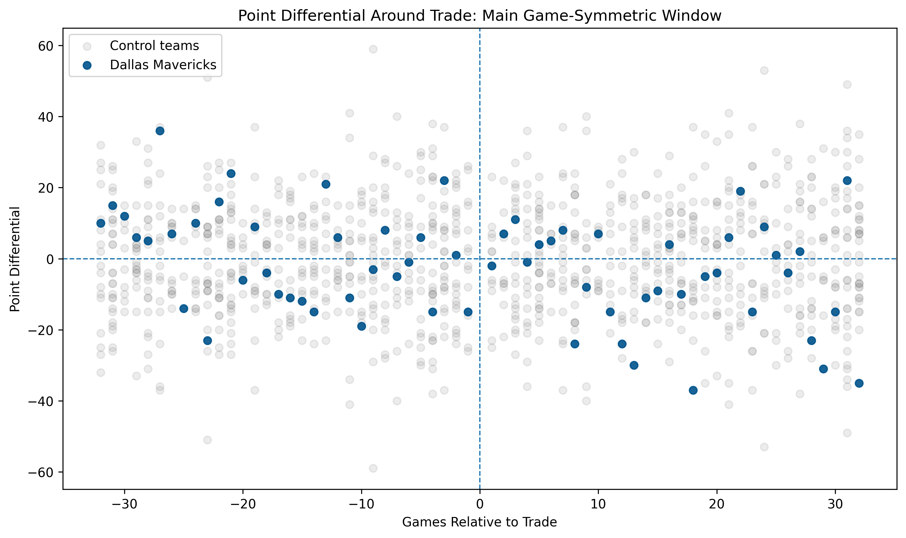
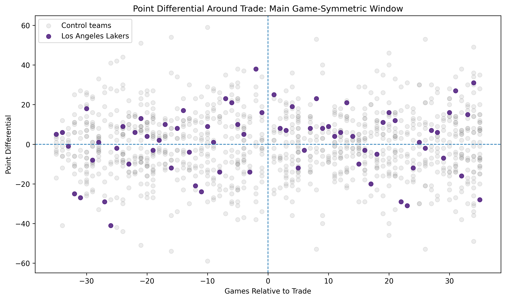

# mavs_luka_DiD

## Overview

This project uses Python to conduct a simplified Difference-in-Differences-style analysis of the February 2025 Luka Doncic / Anthony Davis trade.

The main question is whether the Dallas Mavericks performed worse after trading Luka Doncic, and whether the Los Angeles Lakers show a mirrored improvement after acquiring him.

This is a learning-focused portfolio project designed to demonstrate data collection, cleaning, regression modeling, robustness checks, and visualization in Python.

## Research Design

The script pulls 2024-25 NBA regular-season game logs using `nba_api`, then compares team performance before and after the February 2, 2025 trade date.

Two mirrored analyses are run:

1. **Dallas Mavericks analysis**
   - Treated team: Dallas Mavericks
   - Excluded from controls: Los Angeles Lakers
   - Injury controls: Luka Doncic pre-trade, Anthony Davis post-trade, Kyrie Irving throughout

2. **Los Angeles Lakers analysis**
   - Treated team: Los Angeles Lakers
   - Excluded from controls: Dallas Mavericks
   - Injury controls: Anthony Davis pre-trade, Luka Doncic post-trade, LeBron James throughout

The main outcomes are:

- Win indicator
- Point differential

The preferred specifications include:

- Home/away control
- Back-to-back indicator
- Opponent fixed effects
- Team fixed effects
- Star-player injury controls

## Key Results

The results are directionally consistent with the trade hurting Dallas and helping Los Angeles.

### Dallas Mavericks

In the main game-symmetric window, the injury-adjusted specification estimates that Dallas declined by roughly:

- **24.4 percentage points in win probability**
- **13.4 points of point differential**

| Outcome | Specification | DiD Estimate | Std. Error | p-value |
|---|---:|---:|---:|---:|
| Win | No controls | -0.136 | 0.033 | 0.00003 |
| Win | FE + B2B controls | -0.141 | 0.034 | 0.00004 |
| Win | Injury-adjusted | -0.244 | 0.044 | <0.001 |
| Point differential | No controls | -8.188 | 1.329 | <0.001 |
| Point differential | FE + B2B controls | -9.437 | 1.217 | <0.001 |
| Point differential | Injury-adjusted | -13.447 | 1.460 | <0.001 |

### Los Angeles Lakers

In the main game-symmetric window, the injury-adjusted specification estimates that Los Angeles improved by roughly:

- **15.1 percentage points in win probability**
- **5.8 points of point differential**

| Outcome | Specification | DiD Estimate | Std. Error | p-value |
|---|---:|---:|---:|---:|
| Win | No controls | 0.055 | 0.031 | 0.074 |
| Win | FE + B2B controls | 0.132 | 0.036 | <0.001 |
| Win | Injury-adjusted | 0.151 | 0.040 | <0.001 |
| Point differential | No controls | 3.289 | 1.044 | 0.002 |
| Point differential | FE + B2B controls | 5.388 | 1.078 | <0.001 |
| Point differential | Injury-adjusted | 5.763 | 1.158 | <0.001 |

## Example Figures

### Dallas Mavericks



### Los Angeles Lakers



## Important Caveat

This project should be interpreted as a descriptive empirical exercise, not a definitive causal estimate.

The event-study pre-trend tests reject parallel pre-trends for both the Mavericks and Lakers analyses, meaning the identifying assumptions for a clean causal Difference-in-Differences design are not fully satisfied.

The results are still useful as an exploratory analysis: Dallas appears to worsen after the trade, while the Lakers appear to improve, producing a directionally mirrored pattern.

## Outputs

The script automatically creates:

- Regression tables in `./tables/`
- Figures in `./figures/`

Representative output files include:

- `tables/mavs_luka_DiD_table3.csv` — Dallas main DiD results
- `tables/mavs_luka_DiD_table11.csv` — Lakers main DiD results
- `figures/mavs_luka_DiD_figure1.png` — Dallas point differential plot
- `figures/mavs_luka_DiD_figure5.png` — Lakers point differential plot

## How to Run

```bash
python mavs_luka_DiD.py
```

## Author
David Ford, assisted by ChatGPT